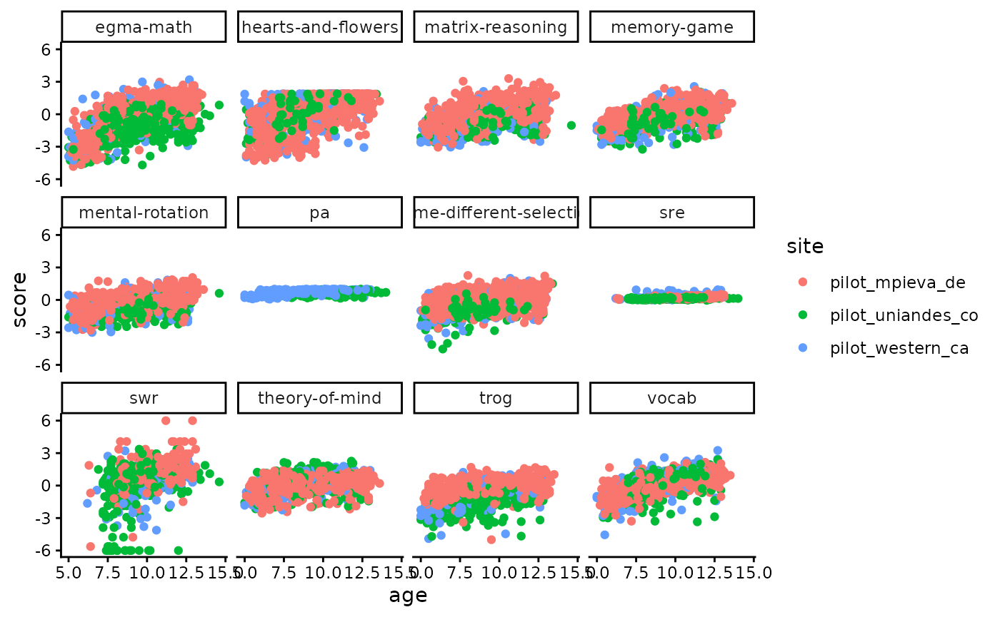

# Data access

``` r
library(rlevante)
library(dplyr)
#> 
#> Attaching package: 'dplyr'
#> The following objects are masked from 'package:stats':
#> 
#>     filter, lag
#> The following objects are masked from 'package:base':
#> 
#>     intersect, setdiff, setequal, union
library(ggplot2)
theme_set(theme_classic())
```

Get scores

``` r
scores <- get_scores(data_source = "levante_data_pilots:68kn", version = "current")
#> Fetching data for levante_data_pilots:68kn
#> --Fetching table scores
scores |> count(dataset, sort = TRUE)
#> # A tibble: 4 × 2
#>   dataset                      n
#>   <chr>                    <int>
#> 1 pilot_mpieva_de_main      4319
#> 2 pilot_uniandes_co_bogota  2463
#> 3 pilot_western_ca_main     1714
#> 4 pilot_uniandes_co_rural    936
scores |> count(task_id, sort = TRUE)
#> # A tibble: 12 × 2
#>    task_id                      n
#>    <chr>                    <int>
#>  1 egma-math                 1245
#>  2 matrix-reasoning           897
#>  3 hearts-and-flowers         876
#>  4 memory-game                859
#>  5 theory-of-mind             853
#>  6 same-different-selection   851
#>  7 trog                       836
#>  8 mental-rotation            803
#>  9 vocab                      775
#> 10 swr                        579
#> 11 sre                        556
#> 12 pa                         302
```

``` r
ggplot(scores, aes(x = age, y = score, colour = site)) +
  facet_wrap(vars(task_id)) +
  geom_point()
#> Warning: Removed 484 rows containing missing values or values outside the scale range
#> (`geom_point()`).
```



Get participants

``` r
participants <- get_participants("levante_data_pilots:68kn")
#> Fetching data for levante_data_pilots:68kn
#> --Fetching table participants
participants |> count(dataset, sort = TRUE)
#> # A tibble: 5 × 2
#>   dataset                      n
#>   <chr>                    <int>
#> 1 pilot_uniandes_co_bogota   674
#> 2 NA                         367
#> 3 pilot_mpieva_de_main       342
#> 4 pilot_western_ca_main      192
#> 5 pilot_uniandes_co_rural    185
```

Get trial-level data

``` r
trials <- get_trials("levante_data_pilots:68kn")
#> Fetching data for levante_data_pilots:68kn
#> --Fetching table trials
trials |> count(dataset, sort = TRUE)
#> # A tibble: 5 × 2
#>   dataset                       n
#>   <chr>                     <int>
#> 1 pilot_mpieva_de_main     235476
#> 2 pilot_uniandes_co_bogota 140745
#> 3 pilot_western_ca_main     86059
#> 4 pilot_uniandes_co_rural   54904
#> 5 NA                        10009
trials |> count(task_id, sort = TRUE)
#> # A tibble: 12 × 2
#>    task_id                       n
#>    <chr>                     <int>
#>  1 egma-math                111691
#>  2 swr                       68831
#>  3 vocab                     60180
#>  4 trog                      54515
#>  5 hearts-and-flowers        53824
#>  6 same-different-selection  44729
#>  7 mental-rotation           33306
#>  8 theory-of-mind            27106
#>  9 sre                       24336
#> 10 matrix-reasoning          21540
#> 11 memory-game               16659
#> 12 pa                        10476
```

Get survey response data

``` r
surveys <- get_surveys("levante_data_pilots:68kn")
#> Fetching data for levante_data_pilots:68kn
#> --Fetching table surveys
surveys |> count(dataset, sort = TRUE)
#> # A tibble: 5 × 2
#>   dataset                      n
#>   <chr>                    <int>
#> 1 pilot_mpieva_de_main     46835
#> 2 pilot_uniandes_co_rural  35838
#> 3 pilot_western_ca_main    34310
#> 4 NA                       22118
#> 5 pilot_uniandes_co_bogota 14204
```
