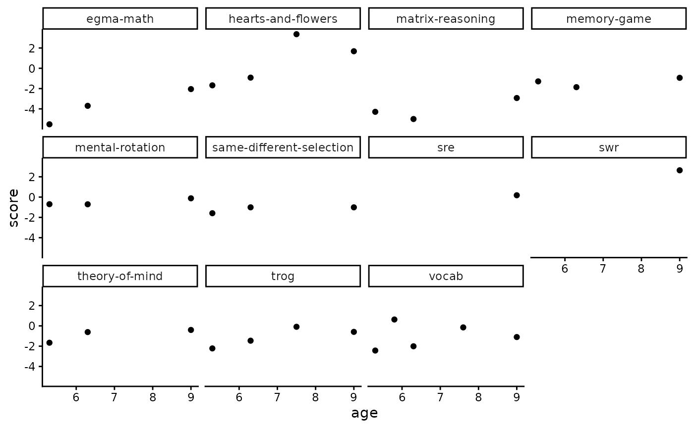

# rlevante_walkthrough

Before you begin this user walkthrough, please see our [rlevante
documentation](https://levante-framework.github.io/rlevante/index.html)
for 1) how to install rlevante and 2) how to gain access to the data.

This walkthrough uses an example dataset of 15 participants
(levante-data-example) for teaching purposes. Access to the example
dataset requires creating an account and joining the LEVANTE
organization on Redivis, a data-sharing platform. For more information,
see our [Researcher Site page on Data
Access](https://researcher.levante-network.org/data).

## From Redivis to R

Permission to access the data is granted via
[Redivis](https://redivis.com/), a data-sharing platform used for all
LEVANTE datasets. Public releases of LEVANTE datasets on Redivis include
at least four tables: participants, scores, surveys, and trials.

**Table 1.** Redivis tables commonly read into data frames by rlevante

[TABLE]

## Using rlevante to load LEVANTE data

Each table from Redivis can be read into R as a data frame using a
specific rlevante “get” function. Each “get” function takes at least two
arguments, including a dataset name (required) and version number
(defaults to the current version unless otherwise specified).

First, load rlevante and other packages, as needed.

``` r

library(rlevante)
#> LEVANTE measures are covered under a CC-BY-NC-SA 4.0 license (https://creativecommons.org/licenses/by-nc-sa/4.0/deed.en). Measures adapted from the Rapid Online Assessment of Reading (Language Sounds, Sentence Reading, Word Reading) are covered under a Stanford Academic License (https://github.com/yeatmanlab/roar-mp/blob/main/LICENSE).
library(dplyr)
#> 
#> Attaching package: 'dplyr'
#> The following objects are masked from 'package:stats':
#> 
#>     filter, lag
#> The following objects are masked from 'package:base':
#> 
#>     intersect, setdiff, setequal, union
library(ggplot2)
theme_set(theme_classic())
```

Then, use `get_participants` to obtain child participant ids,
approximate birthdates, and any associated caregiver or teacher ids.

`get_participants` is the first rlevante function in this code. When you
run it, you’ll be prompted to authenticate with a pop-up browser on
Redivis (an academic database manager that we use at LEVANTE) to ensure
that you have the right permissions to access the dataset. Subsequent
rlevante calls to this dataset within the same session should not
require additional authentication.

``` r

# Pull participant data from Redivis and save it to a data frame called "participants"
participants <- get_participants(data_source = "levante-data-example:d0rt", version = "current") 
#> Fetching data for levante-data-example:d0rt
#> --Fetching table participants

# Now let's do some preliminary checks on the participants data
participants |> count(site, sort = TRUE) # returns the number of participants from each site — the levante-data-example and private site data releases only contain data from a single site, but the public data releases contain many sites/datasets stapled together
#> # A tibble: 1 × 2
#>   site                n
#>   <chr>           <int>
#> 1 pilot_mpieva_de    15
```

Use `get_scores` to obtain scored cognitive task data.

``` r

# Pull scored data from Redivis and save it to a data frame called "scores"
scores <- get_scores(data_source = "levante-data-example:d0rt", version = "current") 
#> Fetching data for levante-data-example:d0rt
#> --Fetching table scores

# Now let's do some preliminary checks on the scores data
scores |> count(task_id, sort = TRUE) # returns the number of scores for each task. for a list of item_task abbreviations, see Table 1 here: https://researcher.levante-network.org/measures/direct-child-measures
#> # A tibble: 11 × 2
#>    task_id                      n
#>    <chr>                    <int>
#>  1 vocab                        5
#>  2 hearts-and-flowers           4
#>  3 trog                         4
#>  4 egma-math                    3
#>  5 matrix-reasoning             3
#>  6 memory-game                  3
#>  7 mental-rotation              3
#>  8 same-different-selection     3
#>  9 theory-of-mind               3
#> 10 sre                          1
#> 11 swr                          1
```

``` r

# This plot returns scores by age fro each task.
ggplot(scores, aes(x = age, y = score)) +
  facet_wrap(vars(task_id)) +
  geom_point()
```



Use `get_trials` to access trial-level data.

``` r

# Pull trial-level data from Redivis and save it to a data frame called "trials"
trials <- get_trials(data_source = "levante-data-example:d0rt", version = "current") 
#> Measures adapted from the Rapid Online Assessment of Reading (Language Sounds, Sentence Reading, Word Reading) are covered under a Stanford Academic License (https://github.com/yeatmanlab/roar-mp/blob/main/LICENSE).
#> Fetching data for levante-data-example:d0rt
#> --Fetching table trials

# Now let's do some preliminary checks on the trials data
trials |> count(site, sort = TRUE) # returns the number of trials per site
#> # A tibble: 1 × 2
#>   site                n
#>   <chr>           <int>
#> 1 pilot_mpieva_de  1320

trials |> count(task_id, sort = TRUE) # returns the number of trials per task
#> # A tibble: 11 × 2
#>    task_id                      n
#>    <chr>                    <int>
#>  1 vocab                      242
#>  2 hearts-and-flowers         236
#>  3 trog                       153
#>  4 egma-math                  124
#>  5 swr                        120
#>  6 matrix-reasoning           106
#>  7 theory-of-mind             102
#>  8 same-different-selection    85
#>  9 mental-rotation             68
#> 10 memory-game                 52
#> 11 sre                         32
```

Use `get_surveys` to access item-level survey data.

``` r

# Pull survey data from Redivis and save it to a data frame called "surveys"
surveys <- get_surveys(data_source = "levante-data-example:d0rt", version = "current") 
#> Fetching data for levante-data-example:d0rt
#> --Fetching table surveys

# Now let's do some preliminary checks on the trials data
surveys |> count(site, sort = TRUE) # returns the number of surveys per site
#> # A tibble: 1 × 2
#>   site                n
#>   <chr>           <int>
#> 1 pilot_mpieva_de    69
```

Use `get_item_parameters` to access the IRT item parameters used in
LEVANTE scoring.

``` r

# Pull up-to-date item parameters from Redivis
item_parameters <- get_item_parameters()
#> Fetching item parameters

item_parameters |> count(item_task, sort = TRUE) # returns the number of parameters per task
#> # A tibble: 11 × 2
#>    item_task     n
#>    <chr>     <int>
#>  1 swr        1383
#>  2 vocab       470
#>  3 math        359
#>  4 tom         171
#>  5 matrix      153
#>  6 pa          110
#>  7 trog         99
#>  8 mg           24
#>  9 sds          17
#> 10 mrot         12
#> 11 hf           10
```

Finally, researchers accessing their own LEVANTE data can use
`get_raw_data` to access additional tables within private datasets.
`get_raw_data` is a general function that can pull any table that you
specify, provided that the table exists. When pulling raw data, please
note that some of the table names are different than the processed data.
Check your dataset page to ensure that the table exists.

``` r

# Pull data from any table within from Redivis – in this case, we're pulling the administrations table (each assignment is an administration)
administrations <- get_raw_table(table_name = "administrations", data_source =  "levante-data-example-raw:bm7r") 
#> Fetching data for levante-data-example-raw:bm7r
#> --Fetching table administrations

administrations |> count(public_name, sort = TRUE) # returns the number of completions per assignment, based on that assignment's name
#> # A tibble: 18 × 2
#>    public_name                     n
#>    <chr>                       <int>
#>  1 Paket 1                         2
#>  2 Paket 3                         2
#>  3 Group3_Roar                     1
#>  4 Group3_noR                      1
#>  5 Paket 2 Group 2                 1
#>  6 Paket 4 (kein Sprachtest)       1
#>  7 Paket 4 (mit Sprachtest)        1
#>  8 Paket 4 (mit Sprachtest) G2     1
#>  9 Paket2                          1
#> 10 Retest_G1&2_Roar                1
#> 11 Retest_G3                       1
#> 12 Retest_G3_R                     1
#> 13 Retest_Group1                   1
#> 14 Runde 1 (Nov 2025)              1
#> 15 Runde 2 (Januar 2026)           1
#> 16 Test_Group4_2                   1
#> 17 Test_Group4_TP1                 1
#> 18 Test_Survey_0825                1
```
